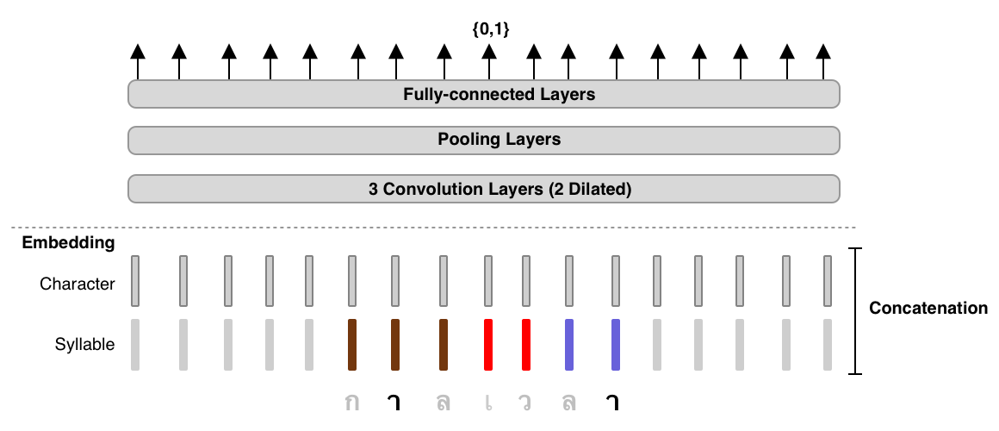

AttaCut: Fast and Reasonably Accurate Word Tokenizer for Thai (beta)
====================================================================

|travis_ic| |pypiversion_ic| |pypidownload_ic| |license_ic| |github_ic|

.. toctree::
    :maxdepth: 2
    :hidden:

    Overview <overview>
    survey
    benchmark
    training
    acknowledgement
    FAQs <faqs>

    **TL;DR**: 3-Layer Dilated CNN on syllable and character features.

Installatation
--------------
.. code-block:: bash

    pip install attacut

**Note:** For **Windows** Users, please install **torch** before installing
running the command above. Visit `PyTorch.org <https://pytorch.org>`_ for
further instructions.

Usage
-----

Command-Line Interface
^^^^^^^^^^^^^^^^^^^^^^
.. code-block:: bash

    $ attacut-cli -h
    AttaCut: Fast and Reasonably Accurate Tokenizer for Thai

    Usage:
    attacut-cli <src> [--dest=<dest>] [--model=<model>]
    attacut-cli (-h | --help)

    Options:
    -h --help         Show this screen.
    --model=<model>   Model to be used [default: attacut-sc].
    --dest=<dest>     If not specified, it'll be <src>-tokenized-by-<model>.txt

Higher-Level Interface
^^^^^^^^^^^^^^^^^^^^^^

.. code-block:: python

    from attacut import Tokenizer

    atta = Tokenizer() # default model: attacut-sc
    atta.tokenizer(txt)

AttaCut will be soon integrated into PyThaiNLP's ecosystem. Please see `PyThaiNLP #28 <https://github.com/PyThaiNLP/pythainlp/issues/258>`_ for recent updates

.. |travis_ic| image:: https://travis-ci.org/PyThaiNLP/attacut.svg?branch=master
    :target: https://travis-ci.org/PyThaiNLP/attacut
.. |pypiversion_ic| image:: https://img.shields.io/pypi/v/attacut
    :target: https://pypi.org/project/attacut/
.. |pypidownload_ic| image:: https://img.shields.io/pypi/dw/attacut
    :target: https://pypi.org/project/attacut/
.. |license_ic| image:: https://img.shields.io/pypi/l/attacut
.. |github_ic| image:: https://img.shields.io/github/stars/pythainlp/attacut?style=social
    :target: http://google.com