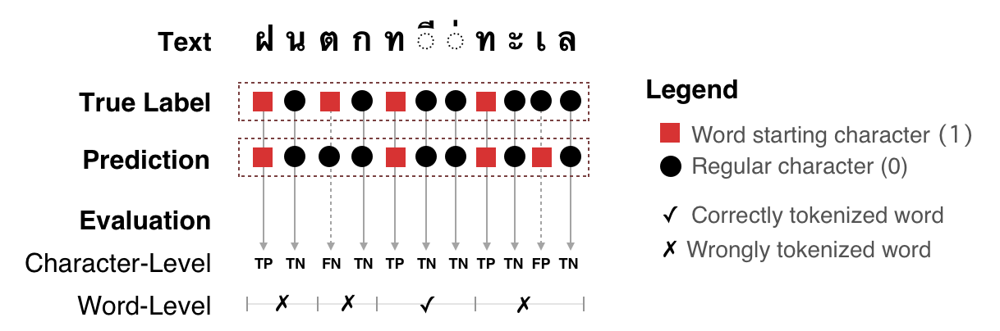

.. _sec-benchmark:

Benchmarking
------------

We value reproducibility. Our experiments should be reproducible and expected
to have similar results when one tries. Therefore, we 1) desrcibe our
benchmarking procedure as complete as possible and 2) publish all the code with
fair amount of documentation.

If there is any doubt or unclear part,
please let us know. We are happy to clarify and improve the document.

Tokenization Quality
^^^^^^^^^^^^^^^^^^^^
Tokenization quality is measured in terms of **precision**, **recall**, and
**f1**. We do the measurements in two levels, namely character and word.
Figure below describes how these metrics are computed:

    Character- and Word-Level Metrics for Word Tokenization

.. code-block::

    Character-Level:
    [P]recision = TP / ( TP + FP )
    [R]ecall = TP / ( TP + FN )
    f1 = 2PR / (P+R)

    Word-Level:
    P = #✓ / #◼︎ in prediction
    R = #✓ / #◼︎ in text

To increase reproducibility and ease further research, we have developed an
evaluation framework for this process. The framework contains two main
ingredients:

1. | **Bechmark CLI**
   | At the moment, this CLI can be found at `@pythainlp's tokenization-benchmark <https://github.com/PyThaiNLP/tokenization-benchmark>`_, but it will be soon released in the main PyThaiNLP package (version 2.1). Please see it this milestone [#milestone]_ for recent updates.
2. | **Result Visualization and Comparison Website**
   | This website serves as a tool for error analysis on tokenization results as well as a benchmark collection of other publicly available tokenizers.

    .. figure:: https://camo.githubusercontent.com/85984f46bb0db3e2bb86b16969b570b7faf4535a/68747470733a2f2f692e696d6775722e636f6d2f56564159485a4d2e706e67

        Tokenization Benchmark Visualization [#viz]_

Speed
^^^^^

Our speed benchmarking is done on standardized environments, namely

1. Google Colab
2. AWS's EC2 instances (t2.small & t2.medium)

.. [#milestone] `PyThaiNLP 2.1 Milestone <https://github.com/PyThaiNLP/pythainlp/milestone/11>`_
.. [#viz] `Tokenization Benchmark Visualization <https://pythainlp.github.io/tokenization-benchmark-visualization/>`_