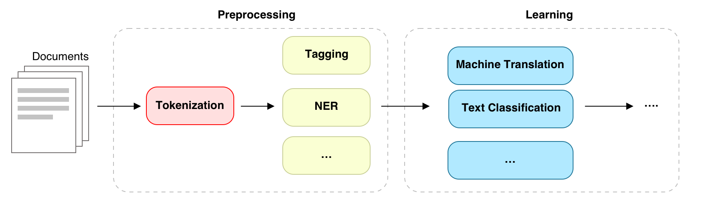
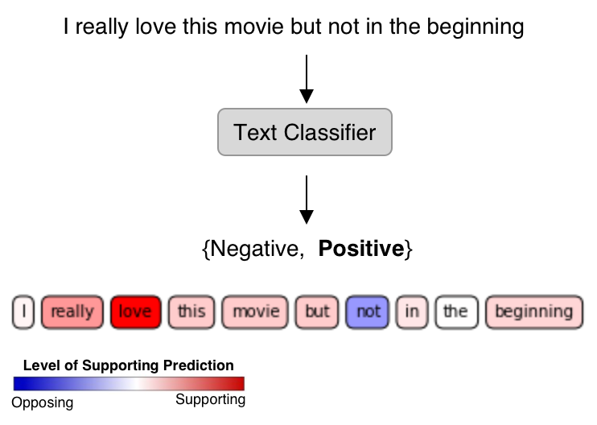

Overview
--------

What is NLP?
^^^^^^^^^^^^^^^^^^^^^^^^^^^

Natural Language Processing (NLP) plays an important role in today's digital era.
Some of its applications are language translation, text classificaiton,
and text understanding. Many algorithms have been proposed and developed to support problems in NLP.

    Typical NLP Pipeline

**[TO WRITE]** Typical NLP Pipeline includes several stages.  Word Segmentation or Tokenization ...
Refere to A'Te and A'Eck courses.

Word Tokenization
^^^^^^^^^^^^^^^^^

    Text Classification on word-level features.
    This example is drawn from `Maximilian Alber's Innvestigate <https://github.com/albermax/innvestigate/blob/master/examples/notebooks/sentiment_analysis.ipynb>`_

Unlike western languages, Thai language has an unique challenge of its own.
No clear separation between words makes it difficult to tokenize Thai text into words, leaving
this ambiguity to be solved in downstream tasks. Without good word-level features, those downstream algorithms
may not be able to process Thai documents efficiently.

To demonstate this challgenge, it is worth examining the คมเพชรเชิงกลอน ภาคสายลม peom [#komped]_ below:

.. code-block::

    สาวตากลมผมยาวเธอคนนั้น    คนที่ฉันนั่งตากลมคอยเฝ้าเพ้อ
    สาวตากลมผมสวยนั้นละเธอ    ที่ฉันเจอนั่งตากลมอยู่ทุกวัน
    ...

In the peom, **ตากลม** appears several times. It could mean **ตา|กลม** (round eye) or **ตาก|ลม** (chilling)
depending on context. For humans who understand Thai, it is quite clear when it should be which case. 

.. rubric:: References

.. [#komped] `คมเพชรเชิงกลอน ภาคสายลม <https://github.com/PyThaiNLP/corpus-komped-poem-windy-part>`_
