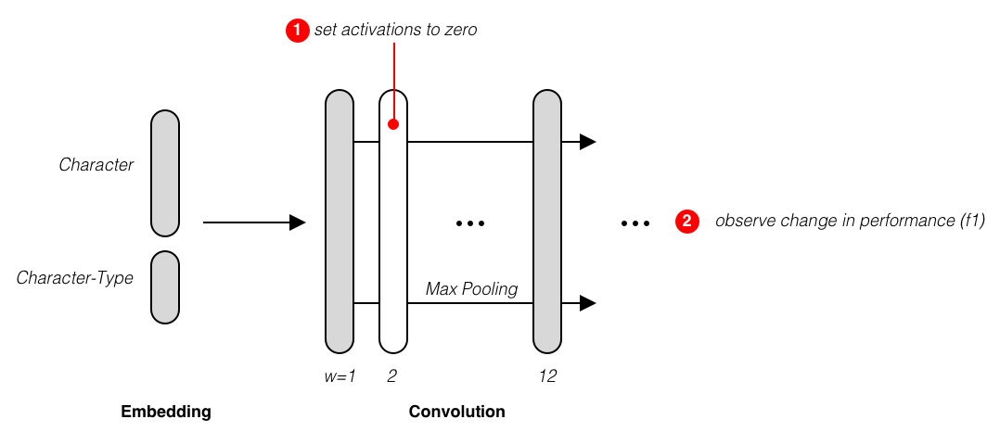

Word Tokenization for Thai
--------------------------

Research in word tokenization for Thai started around 1990. Over these 20 years,
there have been sevaral algorithms being prosed to address the problem. These algorithms
can be clustered into two categories, namely

1. | **Dictionary-based:**
   | Algorithms in this category rely on the use of dictionaries with a mechanism to decide whether to tokenize a particular sequence of characters. Some of algorithms are Chrome's v8BreakIterator [#icu]_  and PyThaiNLP's newmm [#newmm]_.

2. | **Learning-based:**
   | Unlike dictionary-based, algorithms in this group learn to split words based on labelled data. The learning problem is typically formulated as **binary classification** on sequence of characters.

   .. figure:: ../figures/binary-classification.png
        :width: 300px
        :align: center

        Binary Classification for Word Tokenization. **B** denotes a starting-word character, while **I** represents the opposite.

   | With the rise of neural networks, recent developments of Thai tokenizers are either Convolutional Neural Networks (CNNs) (i.e. DeepCut [#deepcut]_) or Recurrent Neural Networks (RNNs) (i.e. [#multicut]_, [#cantok]_, Sertis' Bi-GRUs [#sertis]_).

Generally, these categories have different advantages and disadvantages.
Dictionary-based algorithms are typically fast but with less capable when encountering unknown words.
On the other hand, learning-based approaches are usually qualitatively better and more adaptable to data from different domains; however, their computation is relatively slower.
Figure below summarizes current solutions into two axes: **Quality (Word-Level f1)** and **Inference time**.

   .. figure:: ../figures/previous-work-spectrum.png
        :align: center

        Quality and Inference Time of Existing Thai Word Tokenizers. Please see :ref:`sec-benchmark` for details of evaluation metrics. Device Specification [*]_

From the plot, we can see that the DeepCut is state-of-the-art. However,
it is significantly slower than other algorithms.
While PyThaiNLP's newmm is the the fastest one, lowest inference speed,
it has the lowest tokenization quality.

Because tokenization is usually the first stage in NLP pipelines,
the efficiency and accuracy of the tokenizer are crucial towards building a
successful NLP application. Now, a question arises whether we can build fast
and yet accurate tokenizer for Thai.

Analysis of Deepcut
^^^^^^^^^^^^^^^^^^^
DeepCut is a CNN with 13 different widths of convolution on character features or embeddings.
Pooling is then used to combined features from these convotional layers, yeiding output to a fully-connected layer for final prediction.

   .. figure:: https://user-images.githubusercontent.com/1214890/58486992-14c1d880-8191-11e9-9122-8385750e06bd.png
        :align: center

In total, DeepCut has around 500,000 trainable variables. Looking at DeepCut's
architecture, convotion layers are
significatnly overlapped to each other; hence, these layers are redudant.
With this observation, we have a hyphothesis that DeepCut could be smaller
while achieving a similar level of tokenization quality.

    Finding which layers in DeepCut could be removed.

We design an experiment to verify this proposition. The experiment can be
described as follows:

1. Disable neurons in a layer by zeroing their activitions
2. Observe the change of tokenization quality
3. Repeat 1-2. to other layers

In short, we found that if we remove the convolution layers of kernel width 7,
9, and 10, DeepCut will be 20% faster while its quality drops only 6%. Complete
analysis can be found from our notebook [#deepcutana]_. This result confirms
our hyphothesis that we can have a smaller CNN model that is compentent in
speed and quality.

How does AttaCut look like?
^^^^^^^^^^^^^^^^^^^^^^^^^^^
AttaCut is designed based on two observations:

1. DeepCut Analysis
2. Liguistics..

Syllable + Character features

.. rubric:: References

.. [#icu] International Components for Unicode (ICU) BreakIterator
.. [#newmm] `V. Sornlertlamvanich. Word segmentation for Thai in machine translation system. Machine Translation, NECTEC, pages 556–561, 1993. <https://www.researchgate.net/publication/243659316_Word_segmentation_for_Thai_in_machine_translation_system>`_
.. [#deepcut] `R. Kittinaradorn. DeepCut, 2017. <https://github.com/rkcosmos/deepcut>`_
.. [#multicut] `T. Lapjaturapit, K. Viriyayudhakom, and T. Theeramunkong. Multi-Candidate Word Segmentation using Bi-directional LSTM Neural Networks. pages 1–6, 2018. <https://www.researchgate.net/publication/327516094_Multi-Candidate_Word_Segmentation_using_Bi-directional_LSTM_Neural_Networks>`_
.. [#cantok] `C. Udomcharoenchaikit, P. Vateekul, and P. Boonkwan. Thai Named-Entity Recognition Using Variational Long Short-Term Memory with Conditional Random Field: Selected Revised Papers from the Joint International Symposium on Artificial Intelligence and Natural Language Processing (iSAI-NLP 2017). pages 82–92. 2019. <https://www.researchgate.net/figure/Variational-LSTM-CRF-model-for-Thai-Named-Entity-Recognition_fig1_329766827>`_
.. [#sertis] `Sertis Corp. Thai word segmentation with bi-directional RNN <https://github.com/sertiscorp/thai-word-segmentation>`_
.. [#deepcutana] `P. Chormai. Analysis of DeepCut <https://colab.research.google.com/drive/1Kb_Fhh6bS0sC2k3ovi2ce8AaWqFXNgIT>`_
.. [*] For this experiment, we measured the inference time on MacBook Pro (Retina, 15", Mid 2015), Intel Core i7 @ 2.2 Hz, Memory 16 GB with macOS 10.13.6.